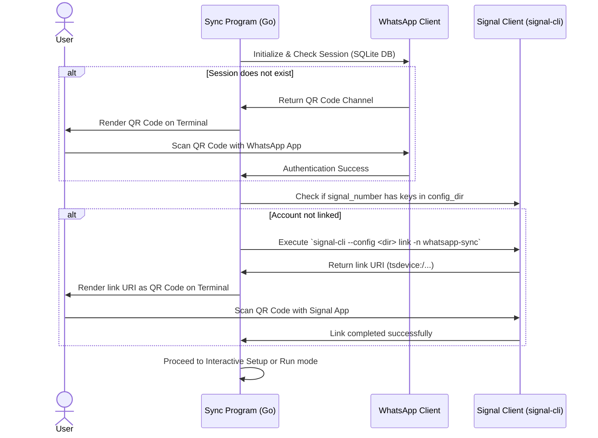

# Design Document: WhatsApp-Signal Sync CLI (Iteration 1)

This design outlines the architecture of the Go CLI application for syncing messages between WhatsApp and Signal, using the binary `signal-cli` as the backend for Signal communication.

## 1. System Overview

The program is a command-line interface (CLI) written in Go. It operates two concurrent communication clients:
1. **WhatsApp Client**: Built using the `whatsmeow` library.
2. **Signal Client**: Built around the `signal-cli` command-line utility, running as a JSON-RPC daemon subprocess.

A **Sync Engine** coordinates events between the two clients based on a local configuration file containing the group mappings.

```mermaid
graph TD
    subgraph Sync Program (Go)
        Engine[Sync Engine]
        Config[Config Manager]
        WA[whatsmeow Client]
        SI[Signal JSON-RPC Client]
    end

    subgraph External
        WAPlatform[WhatsApp Web API]
        SIPlatform[Signal Network]
        SICLI[signal-cli Subprocess]
    end

    Engine --> WA
    Engine --> SI
    WA --> WAPlatform
    SI --> SICLI
    SICLI --> SIPlatform
    Engine <--> Config
```

---

## 2. Configuration (`config.yaml`)

A YAML configuration file (by default `config.yaml` in the working directory) stores authentication directories, user accounts, and linking metadata.

```yaml
# Paths and storage settings
storage:
  whatsapp_db: "./data/whatsapp.db"          # SQLite DB for WhatsApp session persistence
  signal_config_dir: "./data/signal"         # Config directory for signal-cli
  temp_attachment_dir: "./data/tmp"         # For storing temporary images and videos during transfer

# Registered account information
accounts:
  signal_number: "+1234567890"               # Registered Signal phone number (or UUID)
  whatsapp_user_jid: "1234567890@s.whatsapp.net" # User's WhatsApp JID for personal forwards

# Linked groups configuration
# Maps WhatsApp Group JID -> Signal Group ID
group_links:
  "120363024888888888@g.us": "EdY4T25/Tf+1Hk8gY1/p5Q=="
  "120363024999999999@g.us": "ZzY4T25/Tf+2Hk8gY2/p6Q=="
```

---

## 3. Startup & Authentication Flow

At startup, the CLI checks if both WhatsApp and Signal clients are registered/authenticated.



### 3.1 WhatsApp Authentication
- Uses `whatsmeow`'s SQL store.
- If not logged in, `whatsmeow` provides a channel for QR codes. We print this QR code to the terminal using `github.com/skip2/go-qrcode`.

### 3.2 Signal Authentication
- Run `signal-cli --config ./data/signal link -n whatsapp-sync`.
- Capture the stdout containing the `tsdevice:/?uuid=...` URI.
- Convert the URI to a QR code and print it to the terminal.
- Wait for the subprocess to exit (indicating successful linking).

---

## 4. Startup Group Selection & Linking

If the program detects that the `group_links` map is not configured (or when running with a `--setup` flag), it starts an interactive linking prompt:
1. **Fetch WhatsApp Groups**: Query whatsmeow for all joined group JIDs and their names.
2. **Fetch Signal Groups**: Query `signal-cli` via JSON-RPC `listGroups` command.
3. **Interactive Prompt**:
   - Loop through each WhatsApp group.
   - Ask the user: `Link WhatsApp group '<GroupName>' to which Signal group?`
   - Present a numbered list of Signal groups plus the options `[Skip / Personal Forward]` and `[Done]`.
4. **Save Configuration**: Write the resulting mapping to `config.yaml`.

---

## 5. Functional Requirements Implementation

### 5.1 Message Forwarding Logic & Formatting

When a message is received from either platform:

| Source | Dest | Conversation Type | Target Dest JID/ID | Formatting Rule |
| :--- | :--- | :--- | :--- | :--- |
| **WhatsApp** | **Signal** | Personal (Direct Msg) | Personal Signal Number | `WhatsApp received the personal message: <text>` |
| **WhatsApp** | **Signal** | Group (Linked) | Mapped Signal Group ID | `WhatsApp received the group message: <text>` |
| **WhatsApp** | **Signal** | Group (Unmapped) | Personal Signal Number | `WhatsApp received the group message, but there is no corresponding group on Signal: <text>` |
| **Signal** | **WhatsApp** | Personal (Direct Msg) | Personal WhatsApp JID | `Signal received the personal message: <text>` |
| **Signal** | **WhatsApp** | Group (Linked) | Mapped WhatsApp Group JID | `Signal received the group message: <text>` |
| **Signal** | **WhatsApp** | Group (Unmapped) | Personal WhatsApp JID | `Signal received the group message, but there is no corresponding group on WhatsApp: <text>` |

### 5.2 Media Forwarding (Images & Video)
- **WhatsApp to Signal**:
  1. `whatsmeow` receives a message containing `ImageMessage` or `VideoMessage`.
  2. Download the attachment bytes using `whatsmeow.Client.Download()`.
  3. Write the media bytes to a temporary file in `temp_attachment_dir`.
  4. Send a JSON-RPC request to the `signal-cli` daemon using the `send` method, passing the temporary file path in the `attachments` array.
  5. Delete the temporary file.
- **Signal to WhatsApp**:
  1. The `signal-cli` daemon emits a `receive` event containing attachment metadata, including `storedFilename` (the path where `signal-cli` saved it).
  2. Read the file bytes from `storedFilename`.
  3. Upload the bytes to WhatsApp using `whatsmeow.Client.Upload()`.
  4. Build the corresponding `ImageMessage` / `VideoMessage` protobuf payload.
  5. Send the message via `whatsmeow.Client.SendMessage()`.

### 5.3 Unsupported / Poll Messages
- For complex message types like polls, location pins, or contacts:
  - If we cannot easily map the payload, send a fallback text message.
  - E.g.: `WhatsApp received a message that cannot be forwarded. Check your personal WhatsApp.`

---

## 6. Runtime Architecture (Daemon mode)

Once initialized:
1. **Signal Client**: Starts the subprocess `signal-cli --config <dir> --account <account> jsonrpc-daemon` and redirects its stdout/stdin.
   - Runs a goroutine that parses line-by-line JSON-RPC outputs from stdout.
   - Handles `receive` notifications (method: `receive`) and maps them to events.
   - Allows sending requests via JSON-RPC to stdin.
2. **WhatsApp Client**: Connects via websocket, registers the event handler.
3. **Sync Engine**: Coordinates the Go channels and invokes sending routines on the target client.
